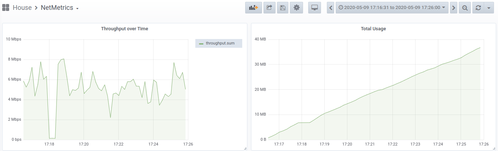

# collect-network-traffic
Store network traffic information in mysql



# Usage
```bash
Usage of ./collect-network-traffic:
  -db string
        db in mysql (default "collect_network_traffic")
  -dsn string
        mysql dsn
  -interfaces string
        comma separated list of interfaces to listen on
  -interval int
        Interval you want to capture each interface with (default 60)
```

# Getting started

1. Go to Releases and get the latest copy of collect-network-traffic for your architecture
2. Install libpcap for your distro: (i.e) `sudo apt install libpcap`
3. Install mysql
4. Run the included sql script
4. Run collect-network-traffic similar to this: `sudo ./collect-network-traffic -interfaces wlan0 -interval 10 -dsn 'collect:test@tcp(mariadb)/collect_network_traffic'`